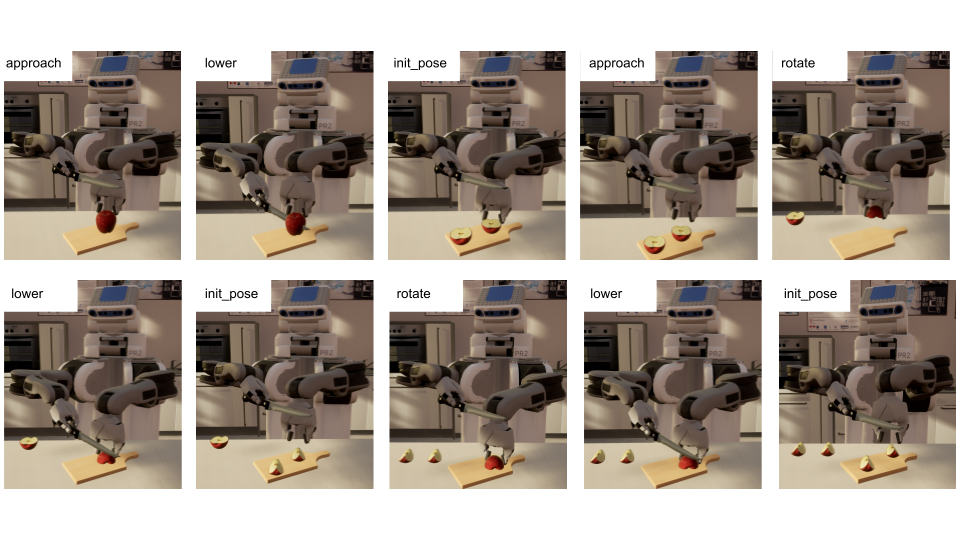

# FoodNinja
This repository includes the simulation enviroment used in our "*Towards a Knowledge Engineering Methodology for Flexible Robot Manipulation in Everyday Tasks*" Paper.

<br>

### Plugin Dependencies:
 - [UCutting](https://github.com/code-iai/UCutting)
 - [URoboSim](https://github.com/urobosim/URoboSim/tree/1255d628a4a58c84d3903d4b31c9943c38676923)
 - [URoboVision](https://github.com/robcog-iai/URoboVision)
 - [UROSBridge](https://github.com/robcog-iai/UROSBridge)
 - [UROSWorldControl](https://github.com/robcog-iai/UROSWorldControl)
 - [UTFPublisher](https://github.com/robcog-iai/UTFPublisher)
 - [UUtils](https://github.com/robcog-iai/UUtils)


### Packaged Version
You can find a packaged Version of the Enviroment itself [here](https://seafile.zfn.uni-bremen.de/f/6b61c46c471d45b1b822/).

**Disclaimer**:
The packaged Version is technically only the enviroment with the robot. As there are many different components used in order to simulate the Robot and all of them need to be setup correctly (for example see setup instruction [URoboSim](https://github.com/urobosim/URoboSim/tree/1255d628a4a58c84d3903d4b31c9943c38676923)), we are not able to share a complete simulation enviroment. 

Usage:
To play around in the enviroment simply unzip the file provided and call the *sh* scripte located in the FoodNinja folder. 
```bash=
unzip -xzf FoodNinjaGame.zip
cd FoodNinja
sh FoodNinja.sh
```
